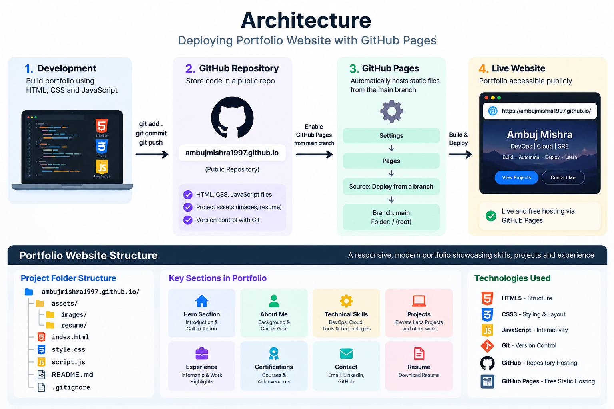

# Ambuj Mishra — DevOps & Cloud Portfolio

A responsive personal portfolio website built with **HTML5, CSS3, and JavaScript** and deployed using **GitHub Pages**.

The portfolio highlights my hands-on work in **DevOps, Cloud, CI/CD, Infrastructure as Code, Git/GitHub workflows, Docker, Jenkins, Terraform, and Linux**.

<p align="center">
  
</p>

---

## Project Objective

Build and deploy a professional static portfolio website using GitHub Pages while practicing Git-based deployment and repository management.

## Live Website

**Portfolio:**  
https://ambujmishra1997.github.io/

## GitHub Repository

https://github.com/ambujmishra1997/ambujmishra1997.github.io

## Tech Stack

- HTML5
- CSS3
- JavaScript
- Git
- GitHub
- GitHub Pages

## Portfolio Highlights

- DevOps / Cloud / SRE introduction
- About Me section
- Technical skills
- Elevate Labs internship experience
- Featured DevOps projects
- GitHub project links
- Contact section
- Responsive design

## Featured DevOps Projects

1. **GitHub Actions CI/CD** — Test → Trivy Scan → Docker Build → Docker Hub  
2. **Jenkins CI/CD** — Checkout → Lint → Test → Trivy → Docker Build → Publish  
3. **Terraform + Docker IaC** — Init → Validate → Plan → Apply → Verify → Destroy  
4. **Git & GitHub Workflow** — Feature → Pull Request → Dev → Pull Request → Main → Release  

## Project Structure

```text
ambujmishra1997.github.io/
|
|-- assets/
|   `-- images/
|       `-- portfolio-github-pages-architecture.png
|
|-- index.html
|-- style.css
|-- script.js
|-- .gitignore
`-- README.md
```

## Deployment Workflow

```text
Build Portfolio
      ↓
Git Add / Commit
      ↓
Push to GitHub
      ↓
GitHub Repository
      ↓
Settings → Pages
      ↓
Deploy from main / root
      ↓
Live Portfolio Website
```

## GitHub Pages Configuration

```text
Source: Deploy from a branch
Branch: main
Folder: / (root)
```

## Run Locally

Open `index.html` directly in a browser, or run:

```bash
python3 -m http.server 8000
```

Then visit:

```text
http://localhost:8000
```

---

## Release History

```text
┌──────────────────────────────────────────────────────────────┐
│                        RELEASE v1.0.0                        │
├──────────────────────────────────────────────────────────────┤
│ Status      : First Stable Release                           │
│ Version     : v1.0.0                                         │
│ Type        : Major / Initial Production Release             │
│ Hosting     : GitHub Pages                                   │
│ Branch      : main                                           │
│ Description : First stable version of the DevOps portfolio   │
└──────────────────────────────────────────────────────────────┘
```

### v1.0.0 — First Stable Release

The first stable version of the portfolio includes:

- Responsive portfolio website
- GitHub Pages deployment
- DevOps / Cloud / SRE introduction
- About Me section
- Technical skills section
- Elevate Labs internship experience
- Featured DevOps projects
- GitHub repository links
- Contact section
- Working email contact option
- Mobile responsive navigation
- Git-based deployment workflow

Release tag:

```text
v1.0.0
```

Release message:

```text
First stable release
```

---

## Versioning Strategy

This portfolio follows **Semantic Versioning**:

```text
MAJOR.MINOR.PATCH
```

Example:

```text
v1.2.3
 │ │ │
 │ │ └── PATCH
 │ └──── MINOR
 └────── MAJOR
```

---

### PATCH Release — Bug Fix

```text
┌──────────────────────────────────────────────────────────────┐
│                         PATCH UPDATE                         │
├──────────────────────────────────────────────────────────────┤
│ Example     : v1.0.0 → v1.0.1                               │
│ Purpose     : Fix bugs without changing existing features    │
│ Examples    :                                                │
│              • Broken contact button                         │
│              • Incorrect project link                        │
│              • CSS / responsive layout fix                   │
│              • Typo or small UI correction                   │
└──────────────────────────────────────────────────────────────┘
```

Example workflow:

```text
Bug Found
   ↓
GitHub Issue
   ↓
fix/<issue-name>
   ↓
Pull Request
   ↓
main
   ↓
v1.0.1
```

---

### MINOR Release — New Project or Feature

```text
┌──────────────────────────────────────────────────────────────┐
│                         MINOR UPDATE                         │
├──────────────────────────────────────────────────────────────┤
│ Example     : v1.0.1 → v1.1.0                               │
│ Purpose     : Add new functionality while keeping existing   │
│               functionality compatible                       │
│ Examples    :                                                │
│              • Add a new DevOps project                      │
│              • Add certifications section                    │
│              • Add downloadable resume                       │
│              • Add new portfolio section                     │
│              • Add LinkedIn / social integrations            │
└──────────────────────────────────────────────────────────────┘
```

Example workflow:

```text
New Project / Feature
        ↓
GitHub Issue
        ↓
feature/<feature-name>
        ↓
Pull Request
        ↓
main
        ↓
v1.1.0
```

---

### MAJOR Release — Major Portfolio Upgrade

```text
┌──────────────────────────────────────────────────────────────┐
│                         MAJOR UPDATE                         │
├──────────────────────────────────────────────────────────────┤
│ Example     : v1.5.2 → v2.0.0                               │
│ Purpose     : Significant redesign or breaking change        │
│ Examples    :                                                │
│              • Complete portfolio redesign                   │
│              • Major navigation / architecture change        │
│              • Replace static structure with a new platform  │
│              • Major technology migration                    │
│              • Large restructuring of the website            │
└──────────────────────────────────────────────────────────────┘
```

Example workflow:

```text
Major Portfolio Upgrade
          ↓
Planning / Issue
          ↓
feature/v2-redesign
          ↓
Testing
          ↓
Pull Request
          ↓
main
          ↓
v2.0.0
```

---

## Future Release Examples

```text
┌───────────┬──────────────────────────────────────────────────┐
│ Version   │ Change                                           │
├───────────┼──────────────────────────────────────────────────┤
│ v1.0.0    │ First stable portfolio release                   │
│ v1.0.1    │ Bug fix                                          │
│ v1.0.2    │ Another small bug fix                            │
│ v1.1.0    │ Add a new DevOps project                         │
│ v1.2.0    │ Add certifications / resume section              │
│ v1.2.1    │ Fix portfolio layout or broken link              │
│ v2.0.0    │ Major redesign / architecture upgrade            │
└───────────┴──────────────────────────────────────────────────┘
```

---

## Release Decision Guide

```text
                 PORTFOLIO CHANGE
                       │
          ┌────────────┼────────────┐
          │            │            │
          ▼            ▼            ▼
       Bug Fix     New Feature    Major Change
          │            │            │
          ▼            ▼            ▼
        PATCH         MINOR        MAJOR
          │            │            │
          ▼            ▼            ▼
       v1.0.1        v1.1.0        v2.0.0
```

### Simple Rule

```text
Bug Fix                → PATCH
New Project / Feature  → MINOR
Major Redesign         → MAJOR
```

---


## Author

**Ambuj Mishra**

GitHub: [ambujmishra1997](https://github.com/ambujmishra1997)

> Built as part of my hands-on DevOps learning and Elevate Labs internship project work.
